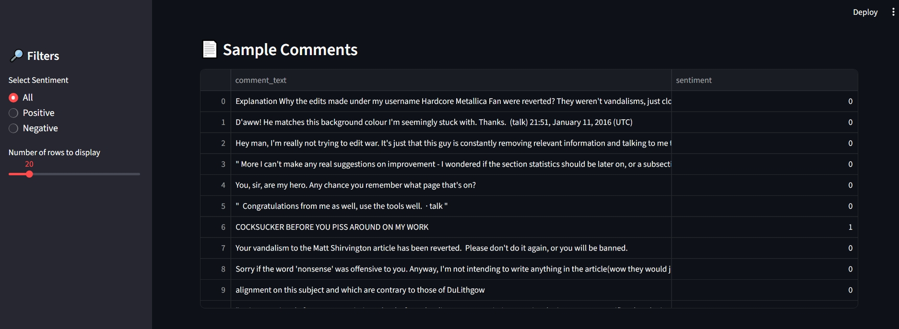
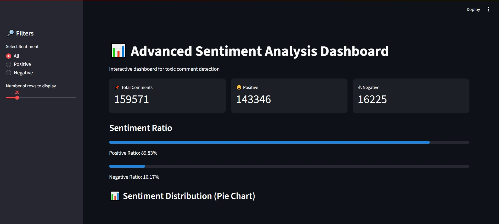
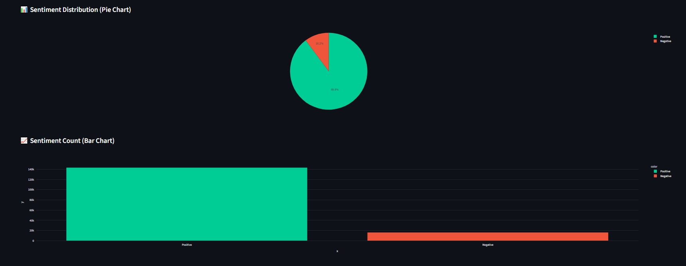
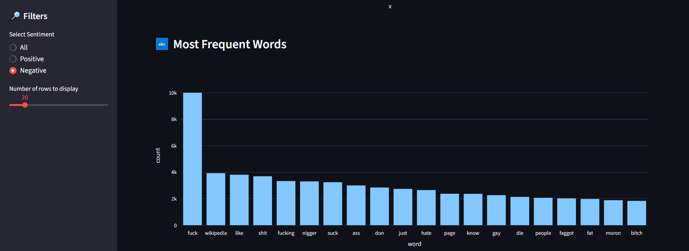
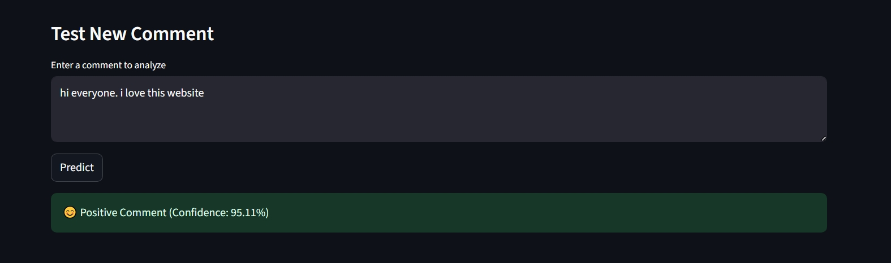
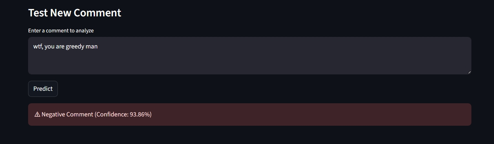

# 📝 Advanced Sentiment Analysis Dashboard (NLP Project)

This project is an **interactive dashboard for sentiment analysis of text comments,** designed to classify comments into **Positive or Negative (toxic)** categories using **Machine Learning**.

## The dashboard also provides **visual insights**, such as sentiment distribution, most frequent words, and allows testing new comments in real-time.

## 📂 Dataset



- Source: Wikipedia comments dataset (`train/train.csv`).
- Labels (multi-label, binary for each class):
  - `toxic`
  - `severe_toxic`
  - `obscene`
  - `threat`
  - `insult`
  - `identity_hate`

**Binary Sentiment:**
0 → Positive (no toxic labels)
1 → Negative (any toxic label present)

---

### 📊 Dashboard Metrics



---

## 🔍 Project Overview

- **Goal**: Detect toxic, offensive, and hateful comments in text.
- **Techniques Used**:
  - Text preprocessing (cleaning, stopword removal, stemming).
  - Feature engineering with **TF-IDF vectorization**.
  - Binary classification using **Logistic Regression**
  - Interactive dashboard with **Streamlit**
  - Data visualization with **Plotly**
- **Main Features**:
- Metrics: Total, Positive, Negative counts
- Progress bars for sentiment ratios
- Pie Chart & Bar Chart for sentiment distribution
- Top 20 most frequent words
- Sample comments table
- Real-time prediction for new comments

---

### 📈 Sentiment Distribution



### 🔤 Most Frequent Words



---

## 📦 Dependencies

Install the required libraries:

```bash
pip install pandas numpy scikit-learn streamlit plotly joblib
```

- **pandas, numpy** → data handling
- **re** → text preprocessing
- **matplotlib, seaborn** → visualization
- **nltk** → stopwords, stemming
- **scikit-learn** → ML models and evaluation

* **Library Usage**:

- **pandas, numpy** → data handling and processing
- **scikit-learn** → TF-IDF vectorizer, Logistic Regression, model pipeline
- **joblib** → save/load trained model
- **streamlit** → interactive web dashboard
- **plotly.express** → interactive charts and visualizations

---

## ⚙️ Data Preprocessing

Steps applied to raw comments:

- Remove punctuation and special characters
- Convert text to lowercase
- Remove stopwords
- Apply stemming (SnowballStemmer)

- Convert comments to string format
- Binary conversion of multi-label toxic categories into 0/1 sentiment
- TF-IDF vectorization automatically handles:
- Lowercasing
- Stopword removal
- Sparse numeric representation of words
- Note: The preprocessing is integrated inside the **model pipeline**, so no separate preprocessing file is required.

---

## Model Training

- Model: Logistic Regression
- **Pipeline**: TF-IDF Vectorizer + Logistic Regression
- **Training**:
- Dataset split into **train (80%)** and **test (20%)**
- Stratified split to maintain class balance
- **Saving model**: joblib.dump(pipeline, "sentiment_model.pkl")

---

## 📈 Dashboard Features

**Metrics Section**:

- Total comments
- Positive comments
- Negative comments
- Progress bars for positive/negative ratio

**Visualizations**:

- **Pie Chart**: Sentiment distribution
- **Bar Chart**: Count of positive/negative comments
- **Top Words Bar Chart**: 20 most frequent words in filtered comments

**Data Table**

- Display sample comments with sentiment label

**Prediction**

- Enter a new comment
- Click **Predict** → Shows:
- Sentiment label (Positive/Negative)
- Confidence score

### 🧪 Predict New Comment



---



---

** How to Run**

- Make sure `train/train.csv` and `sentiment_model.pkl` are in the project folder
- Run the Streamlit app:
  `streamlit run app.py`
- Open the URL provided in the browser to interact with the dashboard

---

## 🔬 Results

- Real-time visualization and metrics allow quick exploration of sentiment trends
- Logistic Regression performs well for binary sentiment classification
- Users can test any new comment and get immediate feedback

---

## 📑 Project Structure

project/
│
├── train/
│ └── train.csv # Dataset
│
├── app.py # Streamlit dashboard
├── model.py # Model training and saving
├── sentiment_model.pkl # Trained model
├── README.md
